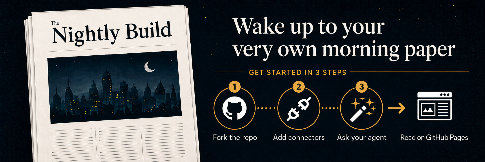
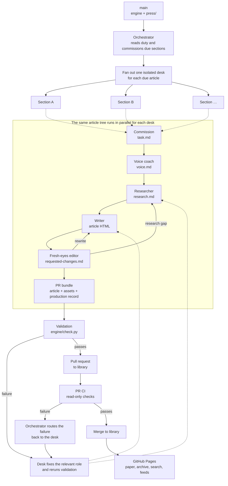

# The Nightly Build



## Your own AI-researched morning paper, published while you sleep

The Nightly Build turns a GitHub repository into a personal newspaper. Describe
what you want to read, connect an agent, and get original, cited articles on
your own GitHub Pages site every morning.

**No backend and no new accounts. It works with your existing AI subscriptions!**

Your paper and its archive live in your fork. You own it.

> [!NOTE]
> Your articles will be searchable from [this website](https://the-nightly-build.github.io/).
> Disable this via setting `directory.publish = false` in your `site.yaml`

## How it works



You configure the paper in `press/`. The orchestrator reads that configuration,
selects the sections due that night, and distributes one commission to an
isolated desk for each article. Each desk runs the same chain: a coach sets the
voice, a researcher builds the evidence, a writer drafts from it, and a fresh
editor challenges the result.

Every stage leaves a named artifact for the next one. The resulting PR carries
the article, any earned assets, and the production record—`task.md`, `voice.md`,
`research.md`, and `requested-changes.md`—so the work can be reviewed rather
than treated as a mysterious final answer.

Validation runs before the PR opens. A validation failure goes back to the
desk and the relevant role. Once the PR is open, CI failures go back through the
orchestrator to that desk for another pass. This separation of labor, evidence,
fresh editing, and automated checks is how the system reduces AI-slop and
hallucination risk without pretending that automation makes judgment
unnecessary. See the [FAQ](#faq) for the security, source, and permission model.

`main` holds the engine and your configuration. `library` holds published
articles. Keeping those branches separate makes engine updates and paper
ownership straightforward.

Since you own the code, you can even make personal changes to the engine.
However, note that then it is on you to resolve conflicts or issues when
you sync your fork.

## Get started

### 1. Fork and bootstrap

Fork this repository with **Copy the main branch only** enabled. Keep the fork
public if you want to use GitHub Pages on the free plan.

Clone the fork and run the setup script (or ask your agent to do this in the next step):

```sh
git clone https://github.com/<you>/<your-paper>.git
cd <your-paper>
./setup.sh
```

The script scaffolds `press/`, creates the empty `library` branch, seeds its
workflows, and configures GitHub Pages and auto-merge. It requires `git`,
`gh` (authenticated), Python 3.10+, and PyYAML.

### 2. Configure your paper

Ask your agent to **set me up**, or copy a starting point from [`examples/`](examples/README.md).
Your paper lives in one small configuration tree:

```text
press/
├── site.yaml                 # title and appearance
├── editorial.md              # paper-wide voice
└── series/<id>/
    ├── series.yaml           # cadence and publishing rules
    └── prompt.md             # what this section covers
```

See [Your paper](docs/press.md) and [Series](docs/series.md) for the full
configuration model.

### 3. Rehearse once

Ask your agent for a **press check**. It runs the article workflow locally,
builds a preview, and lets you tune your paper before anything is published.
This is useful for getting a feel for your prompts as well as the HTML components
that come with the repo and/or your own custom ones, which you can read about in
[Customization](docs/customization.md).

### 4. Schedule the night shift

Ask your agent to help you schedule the night shift. You'll need to make sure
it is set up with wider internet access permissions and the ability to raise
a PR in your repository.

The run derives its work from `press/`, so you do not need to update the schedule
when you add or pause a section. The automation only needs to be updated if the
[automation prompt](docs/scheduling.md#the-schedule-prompt) changes.

Choose a provider schedule or the universal GitHub Actions path in
[Scheduling](docs/scheduling.md). [Harnesses](docs/harnesses.md) lists the
supported agents and how their usage is billed.

### 5. Read your paper

The night shift opens pull requests against `library`. Once the first article
merges, GitHub Pages publishes the newsstand, archive, search index, and feeds.
See [Delivery](docs/delivery.md) for the URLs and feed formats.

## Make it yours

- Change the title and appearance in `press/site.yaml`.
- Set the paper-wide voice in `press/editorial.md`.
- Add sections, beats, cadence, and source requirements under `press/series/`.
- Customize themes, furniture, and templates in `press/`.

The [examples](examples/README.md) are a living reference. [Customization](docs/customization.md)
covers the extension points without requiring engine changes.

For contributors and engine maintainers, start with [PROTOCOL.md](PROTOCOL.md) and
[Updating the engine](docs/press.md#updating-the-engine).

## FAQ

### How does it avoid sounding like AI slop?

The paper-wide editorial brief, series prompt, and voice artifact give the
writer a specific register to work toward. The writer does not invent the
evidence, and a fresh editor reads the result as a skeptical reader, cutting
generic prose and requesting new reporting or a redraft when needed.

### How are hallucinations and citations handled?

The researcher records claims and supporting sources in `research.md`, and the
writer cites from that record. The editor reopens the evidence when a claim is
important or doubtful. Validation checks the article's structure, citation
shape, source policy, and safety; it cannot prove that every sentence is true,
which is why doubt remains a reason to revise or remove a claim.

### What permissions does the night shift need?

It needs a checkout of `main` and `library`, web access for research, and
permission to push a work branch and open a pull request to `library`. The
trusted scheduled run holds the credentials; PR CI validates article changes
read-only and without those secrets. See [Scheduling](docs/scheduling.md) for
the security model and least-privilege setup.

### Can it use private or authenticated sources?

Only when the selected agent runtime can access them. Sources should remain
auditable to the reader, and credentials should never be committed to the
repository or placed in article content.

### Why does every article use a pull request?

The PR is both the publishing gate and the production record. It shows the
article, its validation status, and the research and editorial artifacts that
explain how the article was made. A clean PR can merge into `library`, where
GitHub Pages publishes it.

### What does it cost?

The Nightly Build has no hosted backend fee. Usage depends on the agent you
choose, its plan, the number of sections due, and how much research each series
requests. See [Harnesses](docs/harnesses.md) for provider-specific billing and
the available lower-cost scheduling options.

### Can I keep my paper private?

The repository can be private when your GitHub plan supports private Pages. A
public repository is the simplest option for a free GitHub Pages setup.

MIT licensed. The catalog and Atom feeds are the API.
