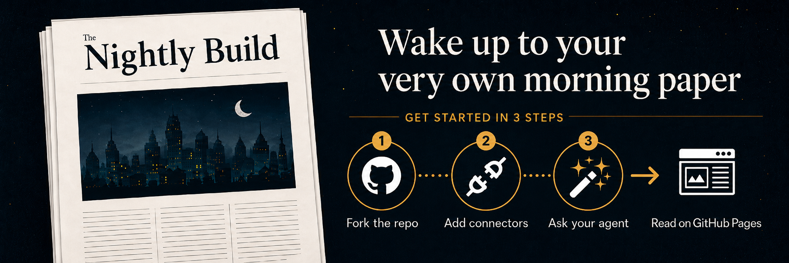
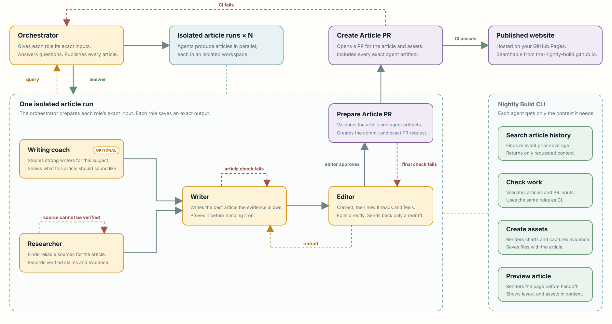

# The Nightly Build



<!-- markdownlint-disable MD026 -->

## Your own AI-researched paper. Ask for an article; schedule the rest.

<!-- markdownlint-enable MD026 -->

The Nightly Build turns a GitHub repository into a personal newspaper. Fork it,
point the AI tool you already use at your fork, and ask for an article on
anything: a topic, a question, a link. It researches, writes, checks its
citations, and publishes to your GitHub Pages site. When you want a paper
waiting every morning, add a schedule.

**No backend and no new accounts. It runs on AI tools you already use.**

Your paper and its archive live in your fork. You own it.

> [!NOTE] Your articles will be searchable from
> [the-nightly-build.github.io](https://the-nightly-build.github.io/)
>
> If you don't want that, opt out in your `site.yaml`:
>
> ```yaml
> directory:
>   publish: false
> ```

## Get started

Fork this repository with **Copy the main branch only** checked. Then take
whichever of these fits the machine in front of you.

**A terminal with `gh` signed in.** Open the checkout in your coding agent and
say:

> Help me set up my Nightly Build paper and write my first article about
> `<topic>`. Follow the repository's instructions.

It runs `./nb setup`, which makes every fork setting itself, then writes the
article and opens the pull request that publishes it.

**No terminal.** In the fork's settings, enable workflows on the Actions tab if
GitHub asks, and set Pages to build from GitHub Actions. Then say the same
sentence to an AI product connected to your GitHub account. It does the git side
of setup, tells you if a setting is still missing, and publishes the article the
same way.

Either way the article lands in Dispatches, the series every paper keeps for
what you ask for, and is live within the hour.
[Ask your AI](docs/getting-started/ask-your-ai.md) has the details, the
[documentation](docs/README.md) the rest, and the
[feature catalog](docs/reference/README.md) lists everything the engine
supports.

When you want articles without asking, add series with a cadence and point a
scheduler at the fork: [Schedule publication](docs/guides/operate/schedule.md)
includes a smoke test that verifies the scheduled environment before it
publishes anything.

## How it works



[Read how the pieces fit together](docs/concepts/architecture.md).

## FAQ

<!-- markdownlint-disable MD033 -->

<details>
<summary><strong>Why did you build this?</strong></summary>

---

<p>I built The Nightly Build because I could not get the morning reading I
wanted. Asking an AI for each subject was manual, checking its citations often
erased the time saved, and news coverage still began from other people's
frames. I wanted to choose what I read, how it was presented, and what evidence
it had to earn.</p>

<p>An overnight schedule makes a different production process practical: the
paper can spend an hour researching, writing, checking, and revising without
making me wait. I wanted to see how far that process could push two problems:
the writing should stop advertising that an AI wrote it, and citations should
support the claims that depend on them. It cannot guarantee truth, but it can
make unsupported work harder to publish.</p>

<p>I also wanted to test a different way to distribute software. Each paper is
a fork, so its owner holds the code, configuration, archive, and deployment
environment. The upstream project provides a system that owners change and
operate for themselves, using the AI provider they choose.</p>

---

</details>

<details>
<summary><strong>How do you keep the writing from sounding like AI?</strong></summary>

---

<p>By anchoring on strong real human writers as examples, and having an aggressive editor
that is prompted to look for common indicators of AI slop as well as bad writing, the quality
that comes out of The Nightly Build is quite a bit higher than my initial expectations. Importantly,
the agents have to pass explicitly codified gates before publishing. Words can be banned. Long
sentences with lots of parentheticals and semicolons can be blocked. Basically, every time I saw
an instance of writing that made me go "ugh that's AI", I tried my best to codify something in the
system itself to prevent it. That being said, given this is something that is customizable, I did
my best to avoid hamstringing the engine from being able to express what downstream users may want.</p>

---

</details>

<details>
<summary><strong>Can it still hallucinate?</strong></summary>

---

<p>Sort of. It is genuinely impossible to guarantee everything said is 100% correct. Though the same is
true of people. The system takes quite a bit of time and uses more tokens than you'd expect because it is
forced to actually read every single source it cites. The editor will even force sentences to be cut if they
cannot properly be demonstrated, and will meticulously try and find issues adversarially. Personally, I have
found this makes hallucinations almost go away entirely. However, I will not promise it.</p>

---

</details>

<details>
<summary><strong>What can the scheduled runtime access?</strong></summary>

---

<p>Only what you grant it. A normal run needs the web, both repository branches,
and permission to open a PR against <code>library</code>. Validation reads
untrusted article code without the scheduler's secrets. See
<a href="docs/concepts/publishing-and-security.md">Publishing and security</a>
for the full trust boundary.</p>

---

</details>

<details>
<summary><strong>Can it read paywalled or authenticated sources?</strong></summary>

---

<p>This is not something that is natively enabled, however you can set that up directly with
your respective AI agent. If you'd like to see how that might work, take a look at
<a href="https://github.com/the-nightly-build/the-nightly-build/issues/127">issue #127</a>.</p>

---

</details>

<details>
<summary><strong>Why does every article use a pull request?</strong></summary>

---

<p>The PR is both the review record and the publishing gate. It carries the
article, its assets, exact agent inputs and outputs, and validation result. Nothing
reaches <code>library</code> without passing CI. This makes it easy to audit
the process if there are issues, as well as give more direct feedback in prompts.
Additionally, PRs are a natural entity that basically every AI harness interacts with.
Ask to read an article first and its PR opens as a draft that nothing merges
until you mark it ready.</p>

---

</details>

<details>
<summary><strong>What does it cost?</strong></summary>

---

<p>There is no hosted-service fee. You pay for the AI runtime you choose, and
hosting can be free. One asked-for article took about 45 minutes of agent time
across the four roles and roughly half a million to a million tokens before any
repair round. A scheduled run of five to seven articles took 45 to 90 minutes
because articles run in parallel. Provider billing and limits vary. See
<a href="docs/reference/production.md">Production cost and role models</a> for
the observed workload and controls.</p>

---

</details>

<details>
<summary><strong>Can I keep my paper private?</strong></summary>

---

<p>Yes, if your GitHub plan supports Pages for private repositories. A public
fork is the simplest free setup.</p>

---

</details>

<details>
<summary><strong>Can I change the engine?</strong></summary>

---

<p>Yes. Most changes belong in <code>press/</code>. Start with
<a href="docs/README.md">the documentation</a>. If you modify the engine
itself, you also own any conflicts when syncing upstream updates.</p>

---

</details>

<!-- markdownlint-enable MD033 -->
